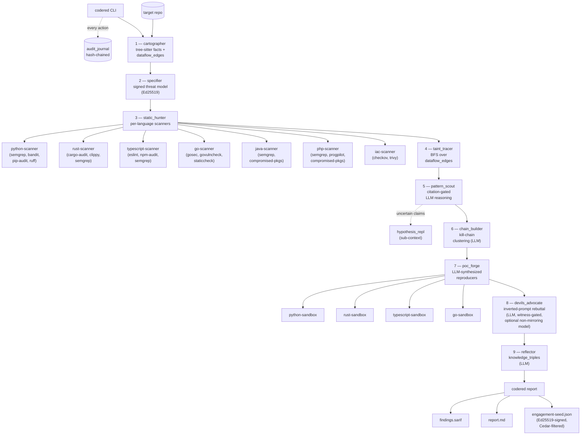

# symbi-codered

**Governed AI source-code auditor.** Multi-language SAST + LLM-driven reasoning + sandboxed PoC validation + devil's-advocate rebuttal, with an evidence chain you can audit.

Produces SARIF + Markdown + a signed `engagement-seed.json` handoff that downstream consumers (e.g. [symbi-redteam](../symbi-redteam)) can ingest to drive exploit validation.

---

## What it is, in one paragraph

Run `codered hunt` against a repo. Static analyzers (semgrep, bandit, clippy, gosec, eslint, checkov, trivy, ...) produce raw findings. A tree-sitter dataflow extractor builds `dataflow_edges`; a mechanical taint tracer walks them. Four LLM agents — `pattern_scout`, `chain_builder`, `poc_forge`, `devils_advocate` — then reason over the evidence: pattern_scout composes citation-gated findings, chain_builder maps them onto the seven-stage Agent Kill Chain, poc_forge synthesizes reproducer scripts that run in network-isolated sandboxes, and devils_advocate runs an inverted-prompt rebuttal pass (optionally on an independent, non-mirroring model). A `reflector` agent distills the engagement into reusable knowledge triples. Every step is Cedar-policy-gated, hash-chained in an audit journal, and signed with a per-engagement Ed25519 key. `codered report` then emits SARIF, Markdown, and an Ed25519-signed JSON handoff.

---

## Status

The full pipeline is implemented and tested: substrate, cartographer, citation-gated static_hunter, chain-aware findings, the confirmation-bias antidote, multi-language coverage, and reporter / handoff / reflector — validated end-to-end against a large real-world polyglot codebase.

**Language coverage today:**

| Language | Parsing | Dataflow + taint | SAST scanners | Sandboxed reproducer |
|----------|:-------:|:----------------:|:-------------:|:--------------------:|
| Python | ✅ | ✅ | semgrep, bandit, pip-audit, ruff | ✅ |
| Rust | ✅ | ✅ | cargo-audit, clippy, semgrep | ✅ |
| TypeScript / JavaScript | ✅ | ✅ | eslint, npm-audit, semgrep | ✅ |
| Go | ✅ | ✅ | gosec, govulncheck, staticcheck | ✅ |
| Java | ✅ | ✅ | semgrep, compromised-packages | ⏳ deferred |
| PHP | ✅ | ✅ | semgrep, progpilot, compromised-packages | ✅ |
| IaC (Terraform / K8s / Dockerfile / GH-Actions) | n/a | n/a | checkov, trivy | n/a |

Java and PHP each ship the full static path (tree-sitter parsing, dataflow extraction, taint, symbols, semgrep SAST; PHP also adds progpilot and compromised-packages). PHP also has a sandbox reproducer (PHP 8.3 CLI + pdo_sqlite); Java's dedicated sandbox reproducer is still deferred, so Java PoCs fall back to citation-grade evidence. The IaC sidecar (checkov + trivy) is wired into the cartographer's language detection and the static_hunter JOBS table (container `symbi-codered-scanner-iac`); its Dockerfile lives in `scanners/iac/`, though the service is not yet in the default `docker-compose.yml` — bring it up alongside the others to exercise it.

**Recent hardening:** independent non-mirroring devils_advocate model (`--advocate-*` flags), witness-gated rebuttal (a finding can only be *suppressed* if the rebuttal cites a structural witness — symmetric with the witness gate on finding *creation*), and a third `poc_status = inconclusive` state so "the reproducer could not run" is no longer silently treated as a disproof.

**Client portal (enterprise).** An authenticated, multi-tenant web UI for sharing engagement results with clients is available as a separate enterprise offering. `hunt` derives its scan target from the engagement's signed threat model (so it can't drift onto the wrong tree); `--target` remains an explicit override.

---

## Architecture



**Trust substrate** (orthogonal to the pipeline):

- **Cedar policy gates** at every `store_finding`, `advocate_finding`, `mark_poc_status`, `write_knowledge_triple`, `emit_to_seed`. Policies live in [`policies/`](policies/).
- **Hash-chained audit journal** (`.symbiont/audit/audit.jsonl`) — every tool invocation + Cedar decision is recorded; `audit::verify_chain` proves no tampering.
- **Per-engagement Ed25519 keypair** (`.symbiont/keys/<eng>.{priv,pub}`) — specifier signs the threat model; reporter signs the engagement-seed.
- **Witness/lawyer rule** ([`policies/citation.cedar`](policies/citation.cedar)) — no finding can be stored without a `Citation::{Analyzer,Code,Hypothesis}`; structurally enforced via attr-bearing Cedar entities.
- **Read-only devil's advocate** ([`policies/tool-authorization.cedar`](policies/tool-authorization.cedar)) — Cedar `forbid` rule prevents `devils_advocate` from ever calling `store_finding`. Verified by `devils_advocate_forbids_store_finding_unconditionally` test.
- **Witnessed rebuttal** ([`policies/advocate.cedar`](policies/advocate.cedar)) — symmetric with citation.cedar: a `devils_advocate` *rebuttal* (`advocate_finding` with `verdict == "rebutted"`) is forbidden unless it cites a structural witness (envelope / sanitizer / closed-set / constant-caller). Suppressing a finding is now as evidence-bound as creating one, and the rebuttal's witness is written as an evidence envelope referenced from the signed journal.
- **Network-isolated sandboxes** for poc_forge — `network_mode: none`, read-only `/repo`, 30s timeout per script.

---

## Quick start

```bash
# Prereqs: docker, docker compose, rust toolchain, Anthropic API key.
git clone <this-repo> && cd symbi-codered
cp .env.example .env  # set ANTHROPIC_API_KEY (and SYMBIONT_*)

# Build the CLI:
cargo build -j2 -p symbi-codered-cli --release

# Bring up the scanner sidecars (per-language; build on first up):
CODERED_TARGET=/path/to/target/repo docker compose up -d \
  python-scanner rust-scanner typescript-scanner go-scanner java-scanner php-scanner \
  python-sandbox rust-sandbox typescript-sandbox go-sandbox

# Run the pipeline:
./target/release/codered carto /path/to/target/repo
# (captures the engagement_id from stdout)
./target/release/codered specifier --engagement <eid> --target /path/to/target/repo
./target/release/codered hunt --engagement <eid>
./target/release/codered report --engagement <eid>

# Outputs:
ls reports/<eid>/
#   findings.sarif
#   report.md
#   engagement-seed.json   (Ed25519-signed, Cedar-filtered)
```

A fully wired audit on a Rust + TypeScript repo takes ~5-15 minutes wall-clock and ~$1-$10 in Claude tokens (depending on finding volume).

#### Independent devil's advocate

By default `devils_advocate` mirrors the generation model. To break the confirmation-bias loop you can point the rebuttal pass at an independent model (e.g. via OpenRouter), with its own fallback chain:

```bash
codered hunt --engagement <eid> \
  --advocate-provider openrouter \
  --advocate-model openai/gpt-4.1 \
  --advocate-fallback minimax/minimax-m2
```

A startup warning fires if the advocate ends up mirroring the generation tier.

### Skipping sidecars

Each scanner sidecar is optional. If `rust-scanner` isn't up, scanner_errors bumps for the rust jobs and the rest continues. Useful for fast iteration on a Python-only target:

```bash
docker compose up -d python-scanner python-sandbox
codered hunt --engagement <eid>     # Rust/TS/Go jobs gracefully error, Python flow completes
```

### Review results in the browser (client portal)

Engagement results can be reviewed through an authenticated, multi-tenant web
UI, available as a separate enterprise offering. Contact ThirdKey for access.

---

## Pipeline stages

| # | Stage | Type | Output |
|---|-------|------|--------|
| 1 | `cartographer` | tree-sitter | `repo_facts`, `symbol_index`, `routes`, `dataflow_edges`, code-chunk LanceDB index |
| 2 | `specifier` | canonical JSON + Ed25519 | `threat_models` row (sources, sinks, scope, signature) |
| 3 | `static_hunter` | docker exec into sidecars | `findings` rows with `Citation::Analyzer` per scanner |
| 4 | `taint_tracer` | mechanical BFS (no LLM) | `taint_chains` rows (source→sink paths) |
| 5 | `pattern_scout` | LLM (Symbiont ORGA loop) | `findings` rows with `Citation::Code` / `Citation::Hypothesis` |
| 6 | `chain_builder` | LLM | `attack_chains` rows mapping to 7-stage Agent Kill Chain |
| 7 | `poc_forge` | LLM + language-specific sandbox | `findings.poc_status` ∈ {reproduced, refuted, inconclusive, reproduced_by_citation} |
| 8 | `devils_advocate` | LLM (inverted prompt, read-only, witness-gated) | `findings.advocate_verdict` ∈ {confirmed, rebutted, uncertain} — rebuttals require a structural witness |
| 9 | `reflector` | LLM | `knowledge_triples` rows (cross-engagement recall substrate) |

Followed by `codered report` (deterministic Rust; no LLM) which renders SARIF + Markdown + signed seed.

**Taint, in context.** A *source* is where untrusted input enters (HTTP params, request bodies, CLI args, env, file reads); a *sink* is an operation that's dangerous with untrusted input (SQL query, shell exec, file path, deserializer, HTML output). The `taint_tracer` does a mechanical BFS over the cartographer's `dataflow_edges` from each source to each sink the specifier pinned — an unsanitized source→sink path becomes a `TaintChain` (SQLi, command injection, path traversal, SSRF, XSS, …). Those chains are the structural *witness* a finding must cite: reachability proof, not just a risky-looking code shape.

---

## Development

```bash
# Build + test:
cargo build  -j2 --workspace
cargo test   -j2 --workspace
cargo clippy -j2 --workspace --all-targets -- -D warnings

# Boot test (builds + smokes orchestrator + python sidecars):
./tests/boot_test.sh

# Boot test with all multi-lang sidecar builds (slow, ~20min):
SYMBI_BOOT_TEST_MULTILANG=1 ./tests/boot_test.sh

# Live e2e (requires ANTHROPIC_API_KEY + running sidecars):
cargo test -j2 -p symbi-codered-cli --test plan_g_e2e -- --ignored
```

### Adding a new scanner

1. Drop a Dockerfile + scanner-runner.py in `scanners/<name>/`
2. Add a service to `docker-compose.yml`
3. Add output parser at `crates/symbi-codered-tools/src/scanner_parsers/<name>.rs`
4. Add ToolClad manifest at `tools/<name>.clad.toml` + bump `toolclad_load` count
5. Add a `ScannerJob` entry in `crates/symbi-codered-tools/src/static_hunter.rs`

### Adding a new language

Same as new scanner, plus:

6. Add the language to `SupportedLanguage` in `crates/symbi-codered-tools/src/tree_sitter_loader.rs`
7. (optional) Extend `dataflow.rs` with `extract_<lang>_edges`
8. Add per-language source/sink defaults to `crates/symbi-codered-tools/src/specifier.rs`
9. Add a per-language sandbox in `scanners/<lang>-sandbox/` and wire poc_forge dispatch

---

## Governance + trust

Everything that touches a finding or a tool call is policy-gated and audited. See:

- [`policies/citation.cedar`](policies/citation.cedar) — every store_finding requires ≥1 citation
- [`policies/evidence.cedar`](policies/evidence.cedar) — every store_finding requires a specifier_hash + non-empty envelope_id
- [`policies/tool-authorization.cedar`](policies/tool-authorization.cedar) — per-agent permits + the `devils-advocate-forbids-store` invariant
- [`policies/advocate.cedar`](policies/advocate.cedar) — a `rebutted` advocate verdict requires a structural witness (suppression is witness-bound, symmetric with finding creation)
- [`policies/handoff.cedar`](policies/handoff.cedar) — which findings are eligible for the redteam handoff (advocate-confirmed/uncertain, citation-bearing, severity ≥ medium, poc not refuted; `inconclusive` is **not** dropped — a non-test is not a disproof)
- [`policies/portal.cedar`](policies/portal.cedar) — client-portal access: operators see all runs, clients see only runs for repos they're granted (fail-closed; unauthorized → 404)
- [`policies/step-up.cedar`](policies/step-up.cedar) — actions requiring out-of-band approval
- [`policies/phase-gates.cedar`](policies/phase-gates.cedar) — ordering constraints between stages
- [`policies/reflector.cedar`](policies/reflector.cedar) — reflector's capability surface

The audit journal at `.symbiont/audit/audit.jsonl` records every tool invocation with its Cedar decision and chains entries via SHA-256. `audit::verify_chain` proves the journal hasn't been tampered with.

---

## License

The codered **core** — the analysis engine and CLI (`carto`, `hunt`, `audit`,
`specifier`, `advocate`, `report`, `export-grc`) plus the `agents/`, `policies/`,
`tools/`, and `scanners/` definitions — is licensed under the
[Apache License 2.0](LICENSE). Copyright © ThirdKey.

Some additional features, including the multi-tenant **client portal**, are a
separate **enterprise** offering and are **not** covered by this license.
Contact ThirdKey for enterprise licensing.

### Building

The core depends on the [Symbiont](https://github.com/ThirdKeyAI/Symbiont)
runtime (`symbi-runtime`), pulled from crates.io — no extra setup required:

```bash
cargo build -j2
```
