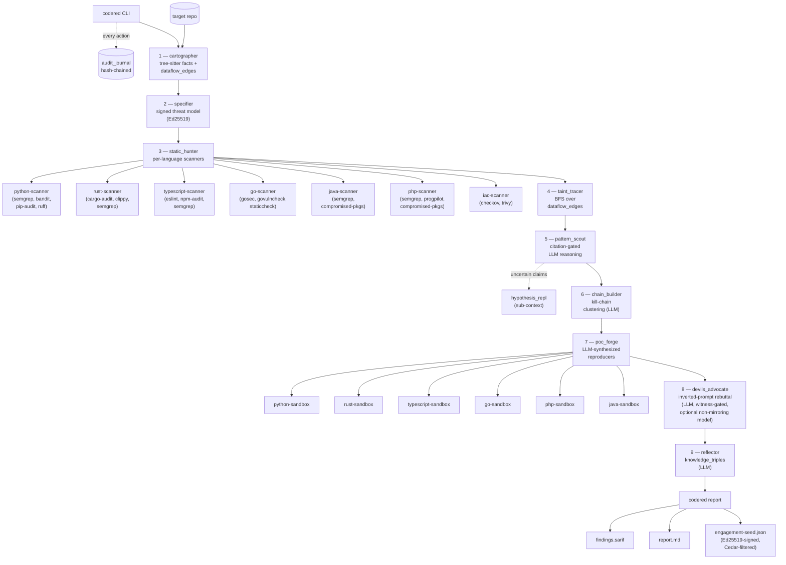

# Architecture

codered is a staged pipeline over a trust substrate. The pipeline turns a target repo into an auditable set of findings; the substrate guarantees that every step is policy-gated, recorded, and signed.

## Trust substrate

Orthogonal to the pipeline, these guarantees hold at every stage:

- **Cedar policy gates** at every `store_finding`, `advocate_finding`, `mark_poc_status`, `write_knowledge_triple`, `emit_to_seed`. Policies live in [`policies/`](https://github.com/ThirdKeyAI/symbi-codered/tree/main/policies).
- **Hash-chained audit journal** (`.symbiont/audit/audit.jsonl`) — every tool invocation and Cedar decision is recorded; `audit::verify_chain` proves no tampering.
- **Per-engagement Ed25519 keypair** (`.symbiont/keys/<eng>.{priv,pub}`) — the specifier signs the threat model; the reporter signs the engagement-seed.
- **Witness/lawyer rule** (`policies/citation.cedar`) — no finding can be stored without a `Citation::{Analyzer,Code,Hypothesis}`; structurally enforced via attr-bearing Cedar entities.
- **Read-only devil's advocate** (`policies/tool-authorization.cedar`) — a Cedar `forbid` rule prevents `devils_advocate` from ever calling `store_finding`.
- **Witnessed rebuttal** (`policies/advocate.cedar`) — symmetric with citation.cedar: a rebuttal can only *suppress* a finding if it cites a structural witness (envelope / sanitizer / closed-set / constant-caller).
- **Network-isolated sandboxes** for poc_forge — `network_mode: none`, read-only `/repo`, time-boxed per script.

See [Governance & Trust](governance.md) for the policy details and [Pipeline Stages](pipeline-stages.md) for what each stage produces.
